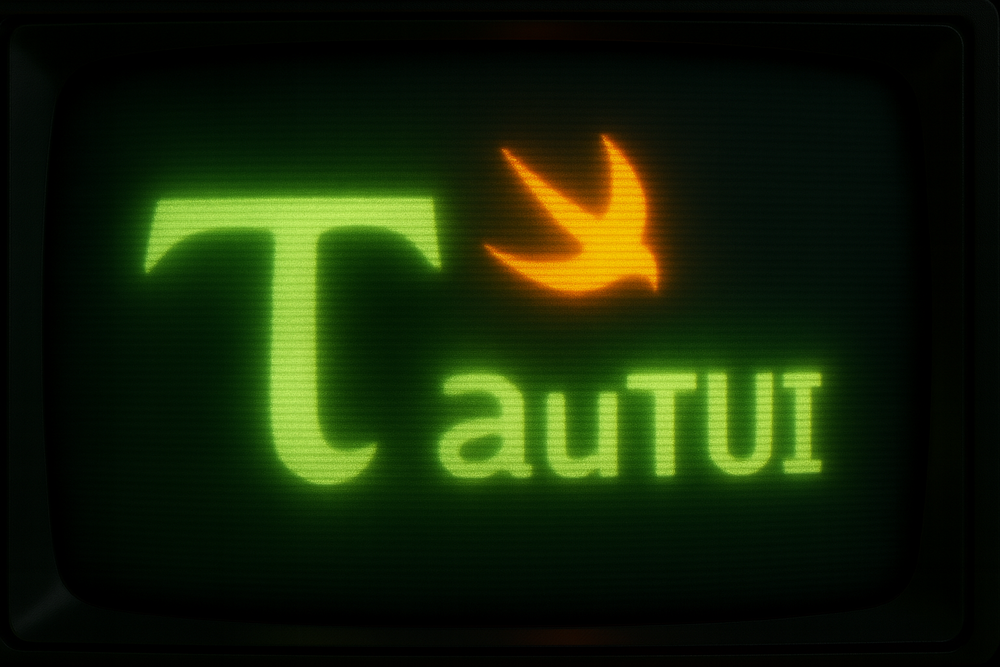

# TauTUI 🖥️ - Swift-native TUI that won’t tear.

<p align="center">
  
</p>

<div align="center">

<p align="center">
  <a href="https://swift.org"></a>
  <a href="https://github.com/steipete/TauTUI"></a>
  <a href="LICENSE"></a>
  <a href="https://github.com/steipete/TauTUI/actions/workflows/ci.yml"></a>
</p>

</div>

TauTUI is a Swift 6 port of [@mariozechner/pi-tui](https://github.com/badlogic/pi-mono/tree/main/packages/tui): the same differential renderer, bracketed paste handling, autocomplete, and component set—implemented with Swift concurrency, value semantics, and native terminal plumbing for macOS + Linux.

## Features

- **Differential Rendering** – Three rendering strategies (first frame, resize/full clear, partial diff) wrapped in CSI 2026 synchronized output for flicker‑free updates.
- **Bracketed Paste Mode** – Handles large pastes via `[paste #n ...]` markers and replaces them on submit, just like pi-tui.
- **Component-based API** – `Component` protocol with `render(width:)` / `handle(input:)`, plus `Container` for composition.
- **Built-in Components** – `Text`, `MarkdownComponent`, `Input`, `Editor`, `SelectList`, `Loader`, `Spacer`, `TruncatedText`.
- **Autocomplete** – Slash-command + filesystem completion via `CombinedAutocompleteProvider`, including `@` attachment filtering.
- **Terminal Implementations** – `ProcessTerminal` (raw mode, modifier-aware key parsing) and `VirtualTerminal` (test harness).

## Quick Start

Add TauTUI to your `Package.swift`:

```swift
// swift-tools-version: 6.2
import PackageDescription

let package = Package(
    name: "Demo",
    platforms: [.macOS(.v13)],
    dependencies: [
        .package(url: "https://github.com/steipete/TauTUI.git", branch: "main"),
    ],
    targets: [
        .executableTarget(
            name: "Demo",
            dependencies: [
                .product(name: "TauTUI", package: "TauTUI"),
            ]),
    ])
```

```swift
import TauTUI

@main
struct DemoApp {
    static func main() throws {
        let terminal = ProcessTerminal()
        let tui = TUI(terminal: terminal)

        let text = Text(text: "Welcome to TauTUI!", paddingX: 1, paddingY: 1)
        tui.addChild(text)

        let editor = Editor()
        editor.onSubmit = { value in
            tui.addChild(MarkdownComponent(text: value))
            tui.requestRender()
        }
        tui.addChild(editor)
        tui.setFocus(editor)

        try tui.start()
        RunLoop.main.run()
    }
}
```

## Core API

### TUI

```swift
let tui = TUI(terminal: ProcessTerminal())
tui.addChild(component)
tui.removeChild(component)
tui.requestRender()
try tui.start()
tui.stop()
```

### Component

Every component conforms to:

```swift
public protocol Component: AnyObject {
    func render(width: Int) -> [String]
    func handle(input: TerminalInput)
}
```

`Container` is a convenience component that renders its children sequentially.

## Built-in Components

### Text

```swift
let text = Text(text: "Hello", paddingX: 2, paddingY: 1)
text.background = Text.Background(red: 30, green: 30, blue: 40)
```

Word-wrapped text with optional RGB background and padding, cached per width.

### MarkdownComponent

```swift
let md = MarkdownComponent(
    text: "# Heading", 
    padding: .init(horizontal: 1, vertical: 1),
    theme: .default,
    defaultTextStyle: .init(
        color: AnsiStyling.rgb(230, 230, 230),
        background: .rgb(52, 53, 65)))
```

Renders headings, lists, tables, blockquotes, and fenced code via `swift-markdown`, with RGB background + foreground tints.

### Input

Single-line editor with fake cursor and horizontal scrolling:

```swift
let input = Input()
input.onSubmit = { print($0) }
input.setValue("Initial text")
```

### Editor

Full multiline editor with autocomplete, modifiers, paste markers:

```swift
let editor = Editor()
editor.onChange = { print("Changed", $0) }
editor.onSubmit = { print("Submitted", $0) }
editor.setAutocompleteProvider(CombinedAutocompleteProvider(commands: [DemoCommand()]))
```

Key bindings include Enter for submit, Shift/Ctrl/Alt+Enter for newlines (Alt is the most reliable across terminals), Ctrl+K/U/W/A/E, Option word motion, Tab for autocomplete, Escape to cancel, etc.

### SelectList

```swift
let list = SelectList(items: [
    SelectItem(value: "clear", label: "Clear", description: "Remove messages"),
    SelectItem(value: "delete", label: "Delete", description: "Delete last"),
])
list.onSelect = { print($0.value) }
list.onCancel = { print("cancel") }
```

Scrollable list with arrow navigation, Enter selection, Escape cancel.

### TruncatedText

```swift
let truncated = TruncatedText(text: "A very long title that will be trimmed…", paddingX: 1)
```

Renders only the first line, truncates with a reset + ellipsis, and pads to the viewport width.

### Loader & Spacer

`Loader` renders the Braille spinner and notifies its `TUI`/closure every tick; `Spacer` inserts empty lines for layout.

## Theming

Theme-aware components accept injected themes; defaults keep the classic look. To change colors globally:

```swift
var palette = ThemePalette.dark()
palette.editor = .init(borderColor: AnsiStyling.color(36), selectList: .default)
palette.markdown = .default // customize fields as needed
palette.textBackground = .init(red: 24, green: 26, blue: 32)

tui.apply(theme: palette)   // pushes themes to children and re-renders
```

You can still pass per-instance themes when constructing components; `apply(theme:)` refreshes any theme-aware component already on screen.

## Autocomplete

`CombinedAutocompleteProvider` supports slash commands, inline command items, file paths, and attachment filtering.

```swift
let provider = CombinedAutocompleteProvider(
    commands: [DemoCommand()],
    staticCommands: [AutocompleteItem(value: "clear", label: "/clear")],
    basePath: FileManager.default.currentDirectoryPath)

struct DemoCommand: SlashCommand {
    let name = "clear"
    let description: String? = "Clear all messages"
    func argumentCompletions(prefix: String) -> [AutocompleteItem] { [] }
}
```

Features:
- Type `/` for commands; Tab auto-completes.
- Tab also forces file completion (`./`, `~/`, `../`, relative paths).
- `@` prefix restricts suggestions to attachable files (text + common images).
- Provider exposes `forceFileSuggestions` / `shouldTriggerFileCompletion` so components can request hints explicitly.

## Differential Rendering

TauTUI mirrors pi-tui’s renderer:

1. **First render** – emit all lines inside `CSI ?2026 h ... l` with no clears.
2. **Resize / change above viewport** – `CSI 3J`, `CSI 2J`, full redraw.
3. **Diff** – compute first/last changed lines, move cursor, clear to end, rewrite modified lines only.

`VisibleWidth.measure` strips ANSI and normalizes tabs (3 spaces) so layout matches the TypeScript implementation.

## Terminal Interface

```swift
public protocol Terminal: AnyObject {
    func start(onInput: @escaping (TerminalInput) -> Void, onResize: @escaping () -> Void) throws
    func stop()
    func write(_ data: String)
    var columns: Int { get }
    var rows: Int { get }
    func moveBy(lines: Int)
    func hideCursor()
    func showCursor()
    func clearLine()
    func clearFromCursor()
    func clearScreen()
}
```

- `ProcessTerminal` puts stdin in raw mode, enables Kitty keyboard protocol, normalizes modifier encodings (CSI params, ESC-prefix meta), turns bracketed paste on/off, and emits `TerminalInput` events (`.key`, `.paste`). Raw bytes are opt-in via `emitsRawInputEvents` (used by `KeyTester`).
- `VirtualTerminal` records writes for tests, tracks viewport/scrollback, and exposes helper methods (`flush()`, `getViewport()`, `getScrollBuffer()`, `getCursorPosition()`).

## Examples

- `swift run ChatDemo` – Swift rewrite of `test/chat-simple.ts`: Markdown chat messages, autocomplete for `/clear` + `/delete`, loader spinner.
- `swift run KeyTester` – Swift version of `test/key-tester.ts`: logs raw hex/codes for every key and paste event.

## Development

```bash
swift build
swift test
swift run ChatDemo
swift run KeyTester
```

TauTUI stays aligned with pi-tui—bug fixes or new components in the TypeScript project are mirrored here using Swift conventions. Contributions are welcome; see `docs/spec.md` for the tracking plan.

## Credits

All credit for the design goes to Mario Zechner and the pi-tui contributors. TauTUI simply brings the same experience to Swift with a native API surface.

License: MIT • Peter Steinberger ([steipete](https://twitter.com/steipete))
